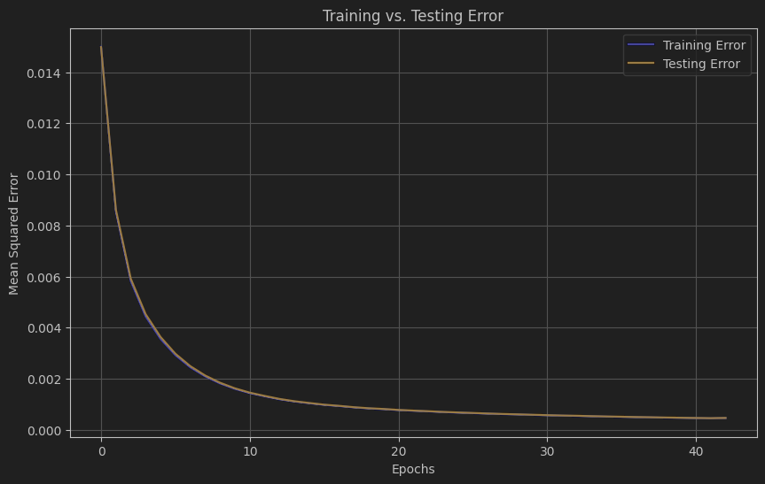
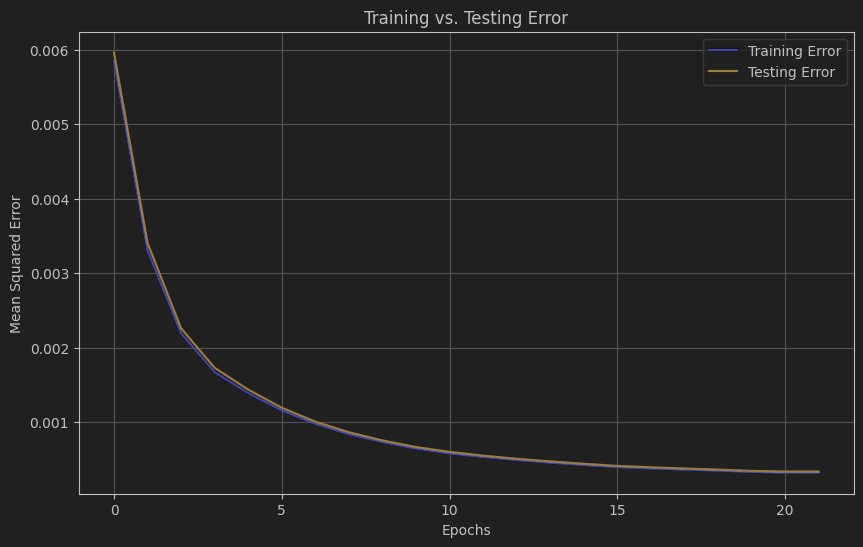
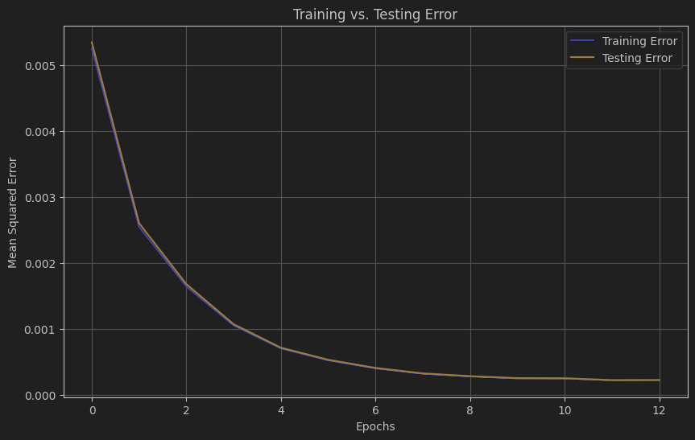
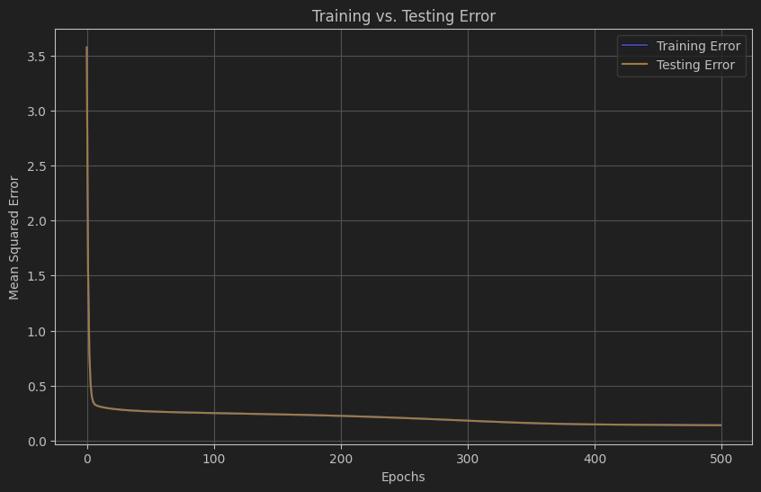
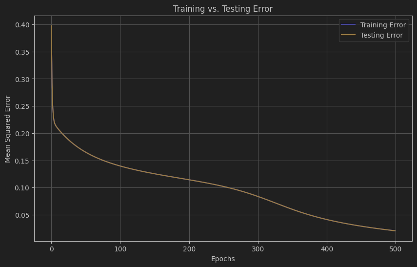

# California Housing regression model

## 1. Architecture description

The neural network model consists of the following layers:

- **Input Layer**: 16 input neurons corresponding to the 16 input features:
    - longitude
    - latitude
    - housing_median_age
    - total_rooms
    - total_bedrooms
    - population
    - households
    - median_income
    - median_house_value
    - INLAND
    - ISLAND
    - NEAR BAY
    - NEAR OCEAN
    - rooms_per_household
    - population_per_household
    - bedrooms_per_room

- **First Hidden Layer**: 64 neurons with a chosen activation function (ReLu, Sigmoid, or Tanh).
- **Second Hidden Layer**: 32 neurons with the same activation function.
- **Third Hidden Layer**: 16 neurons with the same activation function.
- **Output Layer**: 1 neuron with no activation function.

### Layer Overview

| Layer              | Neurons | Activation Function |
|--------------------|---------|---------------------|
| Input Layer        | 16      | None                |
| First Hidden Layer | 64      | [Chosen Activation] |
| Second Hidden Layer| 32      | [Chosen Activation] |
| Third Hidden Layer | 16      | [Chosen Activation] |
| Output Layer       | 1       | None                |

### Description of Connections:
- **Fully Connected Layers**: Each neuron in one layer is connected to every neuron in the next layer.
- **Weight Initialization**: Weights are initialized using He initialization for better convergence.

## 2. Hyperparameter Table

| Hyperparameter          | Value        | Description                                                                         |
|-------------------------|--------------|-------------------------------------------------------------------------------------|
| learning_rate           | 1e-2         | Step size used during optimization.                                                 |
| epochs                  | 200          | Number of training iterations.                                                      |
| b_size                  | 32           | Number of samples per batch in SGD.                                                 |
| tolerance               | 1e-3         | Convergence tolerance for gradient norm.                                            |
| verbose                 | True         | Defines whether the model provides output/graphs during training                    |
| hidden_layers           | [64, 32, 16] | Number of neurons in each hidden layer.                                             |
| decay_rate              | 1 - 1e-4     | Adjusts the learning rate.                                                          |
| activation_func         | 2            | The activation function used in hidden layers (0 - ReLu, 1 - Sigmoid, 2 - Tanh)     |
| early_stopping_patience | 1            | Controls how many epochs the model can continue training after the last improvement |
| momentum                | 0.7          | Controls how much of the previous gradients should influence the current update     |
| epsilon                 | 1e-9         | Stabilizes the updates                                                              |

## 3. Training Progress Graphs

### Training vs Testing Error
- The following graphs show the Mean Squared Error (MSE) during training, plotted against the number of epochs for both training and testing datasets.
    - SGD:

        

      - **Coefficient of determination** (for the test data): 0.9883
      - **Testing error**: 0.0004689
      - **Mean cost difference**: 6738.6969

    - SGD with momentum:

        

      - **Coefficient of determination** (for the test data): 0.9916
      - **Testing error**: 0.0003363
      - **Mean cost difference**: 5609.3812
    
    - Adam:

        
 
      - **Coefficient of determination** (for the test data): 0.9942
      - **Testing error**: 0.0002288
      - **Mean cost difference**: 4417.4312

### Graph Interpretation
- The decrease in error demonstrates the convergence of the model during training.
- The gap between training and testing error remains small, indicating that the model generalizes well, avoiding overfitting.

## Evaluation of Optimization Algorithms and Architectures

### Optimizer Performance
- **SGD**: Shows the least improvement in both testing error and R² compared to the other optimizers.
- **SGDWithMomentum**: Leads to a better testing error and R², indicating that momentum helps accelerate convergence.
- **Adam**: Achieves the best results, with the lowest testing error, highest R², and smallest mean cost difference, showcasing its effectiveness in optimizing the model.

### Architecture Evaluation
- The chosen architecture with 64, 32, and 16 neurons in the hidden layers was successful in learning.
- The choice of activation function played a crucial role in model convergence, with Tanh performing well for this task.

## 5. Conclusion

- **Optimizer Performance**: Both SGD and Adam showed good convergence but Adam performed slightly better with faster error reduction.
- **Architecture Success**: The model successfully tackled the California Housing problem, with the chosen architecture showing good generalization.


# Backpropagation algorithm

### Implementation of Backpropagation

The following Python code defines the `backward` function, which performs the backpropagation for a neural network:

```python
def backward(X, y, activations, z_values, weights, biases, derivative):
    gradients_w = [None] * len(weights)
    gradients_b = [None] * len(biases)

    y_pred = activations[-1]
    error = y_pred - y
    dz = error / X.shape[0]

    for i in reversed(range(len(weights))):
        gradients_w[i] = np.dot(activations[i - 1].T if i > 0 else X.T, dz)
        gradients_b[i] = np.sum(dz, axis=0)

        if i > 0:
            dz = np.dot(dz, weights[i].T) * derivative(z_values[i - 1])

    return gradients_w, gradients_b
```

### Explanation:
- **Error Calculation**:
  - The error at the output layer is calculated as the difference between the predicted output (y_pred) and the actual target values (y).
- **Backward Pass**:
  - The gradients are computed by traversing the network from the output layer to the input layer:
- **Gradients for Weights**:
  - For each layer, the gradient for the weights is calculated by multiplying the activations of the previous layer (or input if it's the first layer) with the error term (dz).
- **Gradients for Biases**: 
  - The gradient for the biases is the sum of the error term across all training examples.
- **Derivative of Activation Function**: 
  - For layers with activation functions (except the output), the derivative of the activation function is computed at each layer to propagate the gradients backward through the network.

## Hyperparameter Table

| Hyperparameter          | Value    | Description                                                                         |
|-------------------------|----------|-------------------------------------------------------------------------------------|
| learning_rate           | 1e-1     | Step size used during optimization.                                                 |
| epochs                  | 500      | Number of training iterations.                                                      |
| b_size                  | 32       | Number of samples per batch in SGD.                                                 |
| tolerance               | 1e-3     | Convergence tolerance for gradient norm.                                            |
| verbose                 | True     | Defines whether the model provides output/graphs during training                    |
| hidden_layers           | [4]      | Number of neurons in each hidden layer.                                             |
| decay_rate              | 1 - 1e-4 | Adjusts the learning rate.                                                          |
| activation_func         | 2        | The activation function used in hidden layers (0 - ReLu, 1 - Sigmoid, 2 - Tanh)     |
| early_stopping_patience | 1        | Controls how many epochs the model can continue training after the last improvement | |


## Training Progress Graphs

## Training vs Testing Error

- The following graphs show the Mean Squared Error (MSE) during training, plotted against the number of epochs for both training and testing datasets.
    - **XOR - SGD**:
  
        

      - **Output**:
        ```
            Testing XOR problem
            Loss: 0.0004699975778434628
            Coefficient of determination: 0.9981200096886261
            Predicted value: 0.016833664480920656 = 0, actual value: 0
            Predicted value: 0.9858356637504214 = 1, actual value: 1
            Predicted value: 0.9733235453238799 = 1, actual value: 1
            Predicted value: 0.02616020634550547 = 0, actual value: 0
        ```
    
    - **AND - SGD**:

        

      - **Output**:
        ```
          Testing AND problem
          Loss: 0.00022091189521366146
          Coefficient of determination: 0.9988218032255272
          Predicted value: -0.019072026434671763 = 0, actual value: 0
          Predicted value: 0.009861978342259548 = 0, actual value: 0
          Predicted value: 0.018791142336357147 = 0, actual value: 0
          Predicted value: 0.9916609508095109 = 1, actual value: 1
        ```
        
    - **AND - SGD**:

        

      - **Output**:
        ```
            Testing XOR problem
            Loss: 0.0004699975778434628
            Coefficient of determination: 0.9981200096886261
            Predicted value: 0.016833664480920656 = 0, actual value: 0
            Predicted value: 0.9858356637504214 = 1, actual value: 1
            Predicted value: 0.9733235453238799 = 1, actual value: 1
            Predicted value: 0.02616020634550547 = 0, actual value: 0
        ```